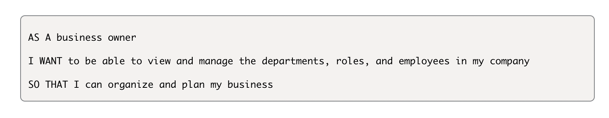

# Employee-Tracker

## Description
manage a company's employee database, using Node.js, Inquirer, and MySQL. It allows the user to track employess, departemnts roles and salaries. 

## User Story 

## Walkthrough Video

https://drive.google.com/file/d/14593_8KLJRWg6t9Z1NkLJpyUXLDQ4sSn/view

## Installation
- Node.js
- Inquirer
- MySQL2 
- dotenv

